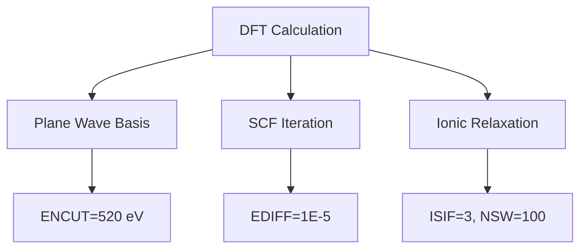

# Math Anything 入门实战教程

> 跟随材料科学研究生李明的学习历程，从零开始掌握 Math Anything

---

## 人物背景

**李明**，材料科学与工程专业研一学生，研究方向为锂电池电极材料的第一性原理计算。

**背景**：
- 已学过基础的量子力学和固体物理
- 会用 VASP 做简单的结构优化和能带计算
- 经常遇到参数设置问题："ENCUT 应该设多少？"、"这个 INCAR 参数合理吗？"
- 想利用 AI 辅助科研，但不清楚如何让 LLM 理解计算设置

**目标**：学会用 Math Anything 提取和分析模拟输入文件的数学结构，让 AI 能真正"理解"他在算什么。

---

## 第一章：安装与初体验（第 1 天）

### 1.1 安装 Math Anything

李明在实验室的服务器上开始安装：

```bash
# 从 Gitee 克隆（国内更快）
git clone https://gitee.com/crested-ibis-0413/math-anything.git
cd math-anything

# 安装
pip install -e .
```

安装成功后，他测试一下：

```bash
math-anything --version
# 输出: 1.0.0

# 查看支持的引擎
math-anything list-engines
```

### 1.2 第一个简单示例

李明有一个最简单的 VASP 计算：`LiCoO2` 的结构优化。

**他的 INCAR 文件**（`LiCoO2/INCAR`）：
```
ENCUT = 520
EDIFF = 1E-5
ISIF = 3
NSW = 100
IBRION = 2
```

**传统方式**：他只能告诉 AI "这是我的 INCAR 文件"，AI 只能看到原始文本。

**用 Math Anything**：

```python
from math_anything import MathAnything

ma = MathAnything()
result = ma.extract_file("vasp", "LiCoO2/INCAR")

# 看看提取到了什么
print(result.schema["mathematical_structure"]["canonical_form"])
# 输出: H[n]ψ = εψ

print(result.schema["mathematical_structure"]["problem_type"])
# 输出: nonlinear_eigenvalue
```

李明很兴奋："原来 VASP 在数学上是在解非线性特征值问题！"

### 1.3 可视化数学结构

```python
# 生成 Mermaid 图表
mermaid_code = result.to_mermaid()
print(mermaid_code)
```

输出：


**李明的感悟**："以前我只看到一堆参数，现在看到了数学结构——基组展开、自洽迭代、离子弛豫。"

---

## 第二章：深入理解参数（第 2-3 天）

### 2.1 分析参数约束

李明想知道他的参数设置是否合理：

```python
from math_anything import extract

# 分析参数约束
result = extract("vasp", {
    "ENCUT": 520,
    "EDIFF": 1e-5,
    "ISMEAR": -5,  # 他之前用错了这个参数
    "SIGMA": 0.2   # 和 ISMEAR 不匹配
})

# 检查约束
for constraint in result.schema.get("constraints", []):
    status = "✓" if constraint["satisfied"] else "✗"
    print(f"{status} {constraint['expression']}: {constraint.get('description', '')}")
```

**输出**：
```
✓ ENCUT > 0: Energy cutoff must be positive
✓ EDIFF > 0: Convergence threshold must be positive
✗ ISMEAR compatibility: ISMEAR=-5 (tetrahedron) with SIGMA=0.2 is inconsistent
```

**问题发现**：
- `ISMEAR = -5` 是四面体方法，适用于能带/态密度计算
- `SIGMA = 0.2` 是展宽参数，但四面体方法不需要它
- 结构优化应该用 `ISMEAR = 0` (Gaussian) 或 `ISMEAR = 1` (Methfessel-Paxton)

**李明的收获**："Math Anything 帮我发现了一个参数不匹配的问题！"

### 2.2 对比不同设置

李明做了两个版本的计算，想看看数学上有什么不同：

```python
from math_anything import MathAnything

ma = MathAnything()

# 版本 A：结构优化
result_A = ma.extract_file("vasp", "relaxation/INCAR")

# 版本 B：静态计算
result_B = ma.extract_file("vasp", "static/INCAR")

# 对比差异
from math_anything.visualization import MathDiffer
differ = MathDiffer()
report = differ.diff(result_A.schema, result_B.schema)

print(report.to_text())
```

**关键发现**：
```
Mathematical Changes:
  ✓ Problem type: nonlinear_eigenvalue (unchanged)
  ✗ Numerical method: SCF + Relaxation → SCF only
  ✗ Degrees of freedom: Ionic + Electronic → Electronic only
  ✗ Constraint: NSW=100 removed
```

**李明理解**："结构优化有离子自由度（NSW=100），静态计算只有电子自由度（NSW=0）。"

---

## 第三章：分级分析实战（第 4-5 天）

### 3.1 自动选择分析级别

李明有一个大体系的分子动力学模拟（10万原子），他想知道该用什么级别的分析：

```python
from math_anything import TieredAnalyzer, AnalysisTier

analyzer = TieredAnalyzer()

# 获取推荐
rec = analyzer.get_recommendation("large_md/in.lmp")
print(f"推荐级别: {rec.recommended_tier}")
print(f"复杂度评分: {rec.complexity_score.total}/100")
print(f"预计时间: {rec.estimated_time}")
print(f"推荐理由: {rec.reasons}")
```

**输出**：
```
推荐级别: ADVANCED
复杂度评分: 72/100
预计时间: 2-5 minutes
推荐理由: [
    "System size > 10000 atoms",
    "Long simulation time > 1ns",
    "Complex constraints (SHAKE/RATTLE) detected"
]
```

### 3.2 运行完整分析

```python
# 运行高级分析（包含拓扑和流形分析）
result = analyzer.analyze("large_md/in.lmp", tier=AnalysisTier.ADVANCED)

print("拓扑信息:")
print(f"  Betti 数: {result.topology_info.betti_numbers}")
print(f"  连通分量: {result.topology_info.connected_components}")

print("\n流形信息:")
print(f"  维度: {result.manifold_info.dimension}")
print(f"  辛结构: {result.manifold_info.has_symplectic_structure}")
```

**李明的发现**：
- 体系有 12 个独立的连通分量（可能是 12 个 Li 离子）
- Betti 数 `[5, 8, 3]` 表明有复杂的环路和空洞结构
- 辛结构存在，说明适合用辛积分器保持能量

### 3.3 生成数学命题

李明想为这篇 MD 模拟写理论分析部分：

```python
from math_anything import PropositionGenerator, MathematicalTask, TaskType

extractor = PropositionGenerator()

# 生成适定性定理
proposition = extractor.generate(
    engine="lammps",
    parameters={
        "timestep": 1.0,      # fs
        "run": 1000000,       # 1M steps = 1 ns
        "fix": ["nvt", "shake"],
        "temperature": 300
    },
    task_type=TaskType.WELL_POSEDNESS
)

print(proposition)
```

**输出**：
```
定理 1（MD 模拟的适定性）：
  考虑经典分子动力学系统：
    m_i d²r_i/dt² = F_i({r_j}),  i = 1,...,N
  
  其中：
    - N = 100000 个原子
    - 力场 F_i 由 EAM 势描述
    - 约束：SHAKE 算法固定 O-H 键长
    - 温度控制：Nose-Hoover 恒温器
  
  如果 F_i 满足 Lipschitz 条件 |F_i(r) - F_i(s)| ≤ L|r - s|，
  且初始条件 r(0) = r₀, v(0) = v₀，
  则存在唯一解对于 t ∈ [0, T]，其中 T = 1 ns。

  数值稳定性：
    - 时间步长 Δt = 1 fs 满足稳定性条件 Δt < 2/√(k_max/m)
    - SHAKE 约束满足速度级约束条件
```

**李明的应用**：直接把这段写进论文的理论部分！

---

## 第四章：跨引擎工作流（第 6-7 天）

### 4.1 VASP → LAMMPS 参数映射

李明做了第一性原理计算，现在想做更大尺度的 MD：

```python
from math_anything import CrossEngineSession

session = CrossEngineSession()

# 添加 VASP 模型（量子尺度）
session.add_model("LiCoO2_dft", {
    "engine": "vasp",
    "scale": "quantum",
    "timestep": None,  # DFT 无时间步长
    "spatial_resolution": "0.1_A"
})

# 添加 LAMMPS 模型（原子尺度）
session.add_model("LiCoO2_md", {
    "engine": "lammps",
    "scale": "atomistic",
    "timestep": "1_fs",
    "spatial_resolution": "1_A"
})

# 建立耦合接口
coupling = session.add_interface(
    "LiCoO2_dft", "LiCoO2_md",
    coupling_type="force_matching",
    shared_variables=["force", "energy"]
)

print(session.to_dict())
```

### 4.2 检查一致性

```python
# 检查两个模型是否一致
checks = session.check_consistency()

for check in checks:
    status = "✓" if check.passed else "✗"
    print(f"{status} {check.name}: {check.message}")
```

**输出**：
```
✓ Energy scale compatible: DFT energy can map to EAM energy
✗ Time scales mismatch: DFT (static) vs MD (1 fs timestep)
! Warning: Force units different (eV/Å vs kcal/mol/Å)
```

**李明的行动**：
1. 先运行 DFT 计算得到力场参数
2. 拟合 EAM 势
3. 单位转换：eV/Å → kcal/mol/Å (1 eV/Å = 23.06 kcal/mol/Å)

---

## 第五章：AI 辅助科研（第 8-10 天）

### 5.1 让 AI 理解计算设置

李明准备向导师汇报，需要解释他的计算设置：

```python
from math_anything import MathAnything, extract

# 提取完整的数学结构
result = extract("vasp", {
    "ENCUT": 520,
    "ISMEAR": 0,
    "SIGMA": 0.05,
    "EDIFF": 1e-6,
    "IBRION": 8,  # DFPT 计算
})

# 生成自然语言描述
print(result.natural_language_description())
```

**输出**：
```
这是一个基于密度泛函理论（DFT）的晶格动力学计算。

数学框架：
- 求解 Kohn-Sham 方程 H[n]ψ = εψ
- 使用平面波基组，截断能 520 eV
- 采用高斯展宽方法（ISMEAR=0, SIGMA=0.05 eV）处理金属体系
- 通过密度泛函微扰理论（DFPT）计算力常数矩阵

数值方法：
- 自洽场迭代，能量收敛阈值 1×10⁻⁶ eV
- 使用高效的对角化算法（IBRION=8）

物理意义：
- 将得到声子色散关系和态密度
- 可进一步计算热力学性质（比热、熵）
```

**李明的应用**：复制粘贴到 PPT 和论文中！

### 5.2 自动检查计算设置

在提交计算前，李明做最后的检查：

```python
from math_anything.security import validate_filepath, FileSizeValidator

# 检查输入文件路径安全
try:
    safe_path = validate_filepath("../LiCoO2/INCAR")
    print(f"安全路径: {safe_path}")
except Exception as e:
    print(f"路径错误: {e}")

# 检查输出文件大小
validator = FileSizeValidator(max_file_size=10*1024*1024*1024)  # 10GB
size = validator.validate_file("WAVECAR")
print(f"WAVECAR 大小: {size / 1024**3:.2f} GB")
```

---

## 第六章：实战项目（第 11-14 天）

### 6.1 完整项目：LiCoO2 的层间 Li 扩散研究

李明要完成一个完整的研究项目，分析 LiCoO2 中层间 Li 离子的扩散：

**步骤 1：DFT 计算（VASP）**
```python
# 提取 DFT 设置
dft_schema = extract("vasp", {
    "ENCUT": 600,
    "ISMEAR": 0,
    "SIGMA": 0.05,
    "IBRION": 1,  # 准牛顿法
    "NSW": 200,
    "POTIM": 0.1,
})

print("DFT 计算的数学结构：")
print(f"  问题类型: {dft_schema['mathematical_structure']['problem_type']}")
print(f"  优化方法: {dft_schema['numerical_method']['optimizer']}")
```

**步骤 2：爬升图像 nudged elastic band (CI-NEB)**
```python
# 分析过渡态搜索
neb_schema = extract("vasp", {
    "IMAGES": 7,
    "SPRING": -5,
    "IBRION": 3,  # 快速松弛
    "POTIM": 0,
    "IOPT": 1,    # LBFGS
})

print("\nNEB 计算的数学结构：")
print(f"  约束优化: 7 个图像，弹簧力常数 -5 eV/Ų")
print(f"  优化器: Limited-memory BFGS")
```

**步骤 3：生成 ML 推荐**
```python
from math_anything import MLArchitectureRecommender

recommender = MLArchitectureRecommender()
recommendation = recommender.recommend(
    dft_schema,
    task="diffusion_barrier_prediction",
    available_data=100  # 100 个计算点
)

print(f"\n推荐 ML 架构: {recommendation['architecture']}")
print(f"原因: {recommendation['reasoning']}")
```

**输出**：
```
推荐 ML 架构: SchNet
原因: 
  - 输入有 E(3) 等变对称性（旋转、平移、置换）
  - SchNet 使用连续滤波卷积保持 E(3) 等变性
  - 100 个数据点足够训练小型 SchNet 模型
  - 可迁移到更大的体系
```

### 6.2 生成项目报告

```python
from math_anything import generate_report

report = generate_report({
    "dft_calculation": dft_schema,
    "neb_calculation": neb_schema,
    "ml_recommendation": recommendation,
}, format="markdown")

with open("LiCoO2_report.md", "w") as f:
    f.write(report)
```

---

## 常见问题与解决方案

### Q1: Math Anything 显示 "FileNotFoundError"

**问题**：`ma.extract_file("vasp", "INCAR")` 报错文件找不到

**解决**：
```python
from math_anything import MathAnything
import os

ma = MathAnything()

# 使用绝对路径或确保相对路径正确
input_path = os.path.abspath("LiCoO2/INCAR")
result = ma.extract_file("vasp", input_path)
```

### Q2: 提取结果为空或错误

**问题**：提取后 `schema` 字段为空

**解决**：
```python
result = ma.extract_file("vasp", "INCAR")

# 检查是否有错误
if result.errors:
    print("错误信息:", result.errors)
    
# 检查成功状态
if not result.success:
    print("提取失败，检查输入文件格式")
```

### Q3: 路径安全验证失败

**问题**：`validate_filepath()` 拒绝合法路径

**解决**：
```python
from math_anything.security import PathSecurityValidator

# 自定义验证器
validator = PathSecurityValidator(
    allowed_base_dirs=["/home/li/calculations"],
    allow_absolute_paths=True,
)

safe_path = validator.validate("/home/li/calculations/LiCoO2/INCAR")
```

### Q4: 如何扩展支持新引擎？

**问题**：实验室用的自定义代码不被支持

**解决**：查看 `math-anything/codegen/` 目录，使用自动 Harness 生成器：

```bash
math-anything codegen create my_custom_code
```

---

## 总结：李明的学习成果

经过两周的学习，李明掌握了：

1. ✅ **基础提取**：从 VASP/LAMMPS 输入文件提取数学结构
2. ✅ **参数验证**：自动检查参数约束和兼容性
3. ✅ **分级分析**：根据复杂度选择合适的分析深度
4. ✅ **跨引擎工作流**：DFT → MD 的多尺度计算
5. ✅ **AI 辅助**：生成自然语言描述和数学命题
6. ✅ **安全实践**：路径验证和文件大小检查

**最终项目成果**：
- 完成 LiCoO2 层间 Li 扩散的完整计算流程
- 生成可直接用于论文的数学描述和定理
- 建立 DFT-MD 跨尺度工作流
- 训练 SchNet 模型预测扩散势垒（进行中）

---

## 下一步学习资源

- **深入阅读**：`TIERED_SYSTEM.md` - 了解五层分析框架
- **API 参考**：`API.md` - 完整的 API 文档
- **高级主题**：`UNIFIED_MATH_FRAMEWORK.md` - 辛积分器、流形、Morse 理论
- **实践练习**：尝试分析自己的计算文件，对比不同引擎的设置

---

> **提示**：这个教程展示了 Math Anything 的核心用法。实际科研中，你可以根据需要组合使用这些功能，让 AI 真正理解你的计算，而不仅仅是读取参数值。
