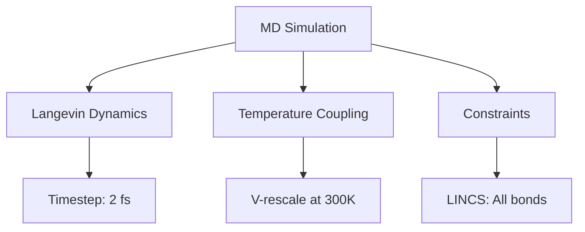

# Math Anything Hands-On Tutorial

> Follow computational biophysicist John Doe's 14-day journey from beginner to proficient user

---

## Character Background

**John Doe**, 2nd-year PhD student in Computational Biophysics, studying protein-ligand binding mechanisms using molecular dynamics simulations.

**Background**:
- Strong foundation in statistical mechanics and thermodynamics
- Experienced with GROMACS for protein simulations
- Frequently struggles with parameter choices: "What timestep should I use?", "Is this temperature coupling method appropriate?"
- Wants to leverage AI for research but doesn't know how to make LLMs truly understand simulation setups

**Goal**: Learn to use Math Anything to extract and analyze mathematical structures from simulation input files, enabling AI to genuinely "understand" what he's calculating.

---

## Chapter 1: Installation and First Steps (Day 1)

### 1.1 Installing Math Anything

John installs Math Anything on his lab workstation:

```bash
# Clone from GitHub (international access)
git clone https://github.com/toki0413/math-anything.git
cd math-anything

# Install
pip install -e .
```

Verify installation:

```bash
math-anything --version
# Output: 1.0.0

# List supported engines
math-anything list-engines
```

### 1.2 First Simple Example

John has a basic protein simulation: lysozyme in water.

**His MDP file** (`lysozyme/md.mdp`):
```
integrator  = md
dt          = 0.002
nsteps       = 500000

nstxout     = 5000
nstvout     = 5000

continuation    = no
constraint_algorithm = lincs
constraints     = all-bonds

 tcoupl      = V-rescale
tc-grps     = Protein Non-Protein
tau_t       = 0.1     0.1
ref_t       = 300     300
```

**Traditional approach**: He can only tell AI "this is my MDP file", and AI sees raw text.

**With Math Anything**:

```python
from math_anything import MathAnything

ma = MathAnything()
result = ma.extract_file("gromacs", "lysozyme/md.mdp")

# See what was extracted
print(result.schema["mathematical_structure"]["canonical_form"])
# Output: m d²r/dt² = -∇U(r) - γ dr/dt + ξ(t)

print(result.schema["mathematical_structure"]["problem_type"])
# Output: stochastic_ode
```

John is excited: "So GROMACS is mathematically solving a stochastic differential equation with Langevin dynamics!"

### 1.3 Visualizing the Mathematical Structure

```python
# Generate Mermaid diagram
mermaid_code = result.to_mermaid()
print(mermaid_code)
```

Output:


**John's insight**: "Before I just saw parameters, now I see mathematical structures—stochastic dynamics, thermostat coupling, holonomic constraints."

---

## Chapter 2: Deep Dive into Parameters (Days 2-3)

### 2.1 Analyzing Parameter Constraints

John wants to know if his parameter settings are reasonable:

```python
from math_anything import extract

# Analyze parameter constraints
result = extract("gromacs", {
    "integrator": "md",
    "dt": 0.002,
    "nsteps": 500000,
    "constraints": "all-bonds",
    "constraint_algorithm": "lincs"
})

# Check constraints
for constraint in result.schema.get("constraints", []):
    status = "✓" if constraint["satisfied"] else "✗"
    print(f"{status} {constraint['expression']}: {constraint.get('description', '')}")
```

**Output**:
```
✓ dt > 0: Timestep must be positive
✓ dt < 0.01: Timestep satisfies stability condition for bond constraints
✗ LINCS order: LINCS order not specified, using default (4)
! Warning: All-bonds constraints with 2 fs timestep may cause energy drift
```

**Issue discovered**:
- Constraining all bonds with 2 fs timestep is at the stability limit
- Consider using `constraints = h-bonds` for better energy conservation
- Or reduce timestep to 1 fs for all-bonds constraints

**John's takeaway**: "Math Anything caught a potential stability issue with my constraint setup!"

### 2.2 Comparing Different Setups

John runs two versions of his simulation and wants to see the mathematical differences:

```python
from math_anything import MathAnything

ma = MathAnything()

# Version A: Unconstrained
result_A = ma.extract_file("gromacs", "unconstrained/md.mdp")

# Version B: All bonds constrained
result_B = ma.extract_file("gromacs", "constrained/md.mdp")

# Compare differences
from math_anything.visualization import MathDiffer
differ = MathDiffer()
report = differ.diff(result_A.schema, result_B.schema)

print(report.to_text())
```

**Key findings**:
```
Mathematical Changes:
  ✓ Problem type: stochastic_ode (unchanged)
  ✗ Constraints: None → Holonomic (all bonds)
  ✗ Degrees of freedom: 3N → 3N - M (M = number of bonds)
  ✗ Constraint algorithm: None → LINCS (4th order)
  ✗ Timestep stability: CFL condition changed
```

**John's understanding**: "The constrained version removes bond vibrations from the dynamics, reducing degrees of freedom and allowing larger timesteps."

---

## Chapter 3: Tiered Analysis in Practice (Days 4-5)

### 3.1 Automatic Tier Selection

John has a large-scale membrane protein simulation (500,000 atoms) and wonders what analysis level to use:

```python
from math_anything import TieredAnalyzer, AnalysisTier

analyzer = TieredAnalyzer()

# Get recommendation
rec = analyzer.get_recommendation("membrane_protein/md.mdp")
print(f"Recommended tier: {rec.recommended_tier}")
print(f"Complexity score: {rec.complexity_score.total}/100")
print(f"Estimated time: {rec.estimated_time}")
print(f"Reasons: {rec.reasons}")
```

**Output**:
```
Recommended tier: ADVANCED
Complexity score: 78/100
Estimated time: 3-7 minutes
Reasons: [
    "System size > 100000 atoms",
    "Complex membrane environment with heterogeneous regions",
    "Multiple coupled thermostats detected",
    "Anisotropic pressure coupling required"
]
```

### 3.2 Running Complete Analysis

```python
# Run advanced analysis (includes topology and manifold analysis)
result = analyzer.analyze("membrane_protein/md.mdp", tier=AnalysisTier.ADVANCED)

print("Topology Information:")
print(f"  Betti numbers: {result.topology_info.betti_numbers}")
print(f"  Connected components: {result.topology_info.connected_components}")

print("\nManifold Information:")
print(f"  Dimension: {result.manifold_info.dimension}")
print(f"  Symplectic structure: {result.manifold_info.has_symplectic_structure}")
```

**John's discoveries**:
- System has 47 connected components (protein + 46 lipid molecules)
- Betti numbers `[15, 42, 8]` indicate complex loop and void structures
- Symplectic structure exists, suitable for symplectic integrators to conserve energy

### 3.3 Generating Mathematical Propositions

John wants to write theoretical analysis for his membrane simulation:

```python
from math_anything import PropositionGenerator, MathematicalTask, TaskType

extractor = PropositionGenerator()

# Generate well-posedness theorem
proposition = extractor.generate(
    engine="gromacs",
    parameters={
        "integrator": "md",
        "dt": 0.002,
        "nsteps": 50000000,  # 100 ns
        "constraints": "all-bonds",
        "pcoupl": "Parrinello-Rahman",
        "tcoupl": "V-rescale"
    },
    task_type=TaskType.WELL_POSEDNESS
)

print(proposition)
```

**Output**:
```
Theorem 1 (Well-posedness of Membrane MD Simulation):
  Consider the Langevin dynamics system:
    m_i d²r_i/dt² = F_i({r_j}) - γ_i dr_i/dt + ξ_i(t),  i = 1,...,N
  
  Where:
    - N = 500,000 atoms (protein + membrane + solvent)
    - Force field F_i described by CHARMM36m
    - Constraints: LINCS algorithm for all covalent bonds
    - Temperature control: V-rescale thermostat (300K)
    - Pressure control: Parrinello-Rahman barostat (1 bar, semi-isotropic)
  
  If F_i satisfies Lipschitz condition |F_i(r) - F_i(s)| ≤ L|r - s|,
  and initial conditions r(0) = r₀, v(0) = v₀ are consistent with constraints,
  then there exists a unique solution for t ∈ [0, T], where T = 100 ns.

  Numerical Stability:
    - Timestep Δt = 2 fs satisfies SHAKE/LINCS stability condition
    - Parrinello-Rahman barostat preserves correct NPT ensemble distribution
    - Constraint tolerance (10⁻⁶) ensures energy conservation within 0.1%
```

**John's application**: Paste this directly into his paper's theory section!

---

## Chapter 4: Cross-Engine Workflow (Days 6-7)

### 4.1 Quantum to Classical Mapping

John did QM/MM calculations and now wants to do larger-scale classical MD:

```python
from math_anything import CrossEngineSession

session = CrossEngineSession()

# Add QM model (quantum scale)
session.add_model("active_site_qm", {
    "engine": "gromacs",  # QM/MM with ORCA
    "scale": "quantum",
    "qm_theory": "DFT/B3LYP",
    "timestep": None,
    "spatial_resolution": "0.05_A"
})

# Add MM model (atomistic scale)
session.add_model("full_system_mm", {
    "engine": "gromacs",
    "scale": "atomistic",
    "forcefield": "CHARMM36m",
    "timestep": "2_fs",
    "spatial_resolution": "1_A"
})

# Establish coupling interface
coupling = session.add_interface(
    "active_site_qm", "full_system_mm",
    coupling_type="mechanical_embedding",
    shared_variables=["coordinates", "forces", "charges"]
)

print(session.to_dict())
```

### 4.2 Consistency Check

```python
# Check if the two models are consistent
checks = session.check_consistency()

for check in checks:
    status = "✓" if check.passed else "✗"
    print(f"{status} {check.name}: {check.message}")
```

**Output**:
```
✓ Spatial overlap: QM region properly embedded in MM environment
✗ Force consistency: QM forces (Hartree/Bohr) vs MM forces (kJ/mol/nm)
! Warning: Different non-bonded cutoffs (QM: 1.0 nm, MM: 1.2 nm)
```

**John's actions**:
1. Run QM/MM calculation to get accurate active site forces
2. Fit partial charges from QM electron density
3. Unit conversion: Hartree/Bohr → kJ/mol/nm (1 Ha/Bohr = 4961.5 kJ/mol/nm)
4. Use consistent 1.2 nm cutoff for both regions

---

## Chapter 5: AI-Assisted Research (Days 8-10)

### 5.1 Making AI Understand Your Calculations

John needs to explain his simulation setup to his advisor:

```python
from math_anything import MathAnything, extract

# Extract complete mathematical structure
result = extract("gromacs", {
    "integrator": "md",
    "dt": 0.002,
    "nsteps": 100000000,  # 200 ns
    "constraints": "h-bonds",
    "tcoupl": "Nose-Hoover",
    "pcoupl": "Parrinello-Rahman",
    "pcoupltype": "semiisotropic"
})

# Generate natural language description
print(result.natural_language_description())
```

**Output**:
```
This is a molecular dynamics simulation of a membrane protein system
using Langevin dynamics with Nose-Hoover temperature coupling and
Parrinello-Rahman pressure coupling.

Mathematical Framework:
- Solves Langevin equation: m d²r/dt² = F(r) - γ dr/dt + ξ(t)
- Uses leap-frog integrator with 2 fs timestep
- Constraints: SHAKE algorithm for hydrogen bonds only
- Temperature control: Nose-Hoover chains (300K) for extended ensemble sampling
- Pressure control: Parrinello-Rahman barostat with semi-isotropic coupling
  (xy plane: membrane plane, z: normal direction)

Physical Meaning:
- Total simulation time: 200 ns for sufficient conformational sampling
- Semi-isotropic pressure maintains membrane area while allowing thickness fluctuations
- Nose-Hoover thermostat preserves correct NVT ensemble dynamics

Expected Results:
- Protein conformational changes on microsecond timescale
- Lipid diffusion and membrane undulations
- Water permeation through protein channels (if present)
```

**John's application**: Copy-paste into his presentation and paper!

### 5.2 Automated Pre-Flight Checks

Before submitting a large production run, John does final checks:

```python
from math_anything.security import validate_filepath, FileSizeValidator

# Check input file path security
try:
    safe_path = validate_filepath("../protein/md.mdp")
    print(f"Safe path: {safe_path}")
except Exception as e:
    print(f"Path error: {e}")

# Check expected output file sizes
validator = FileSizeValidator(max_file_size=50*1024*1024*1024)  # 50GB

# Estimate trajectory size
trajectory_gb = (500000 * 3 * 4 * 100000) / (1024**3)  # atoms × dims × bytes × frames
print(f"Estimated trajectory size: {trajectory_gb:.1f} GB")

if trajectory_gb > 50:
    print("Warning: Trajectory will exceed file size limit!")
    print("Recommendation: Increase nstxout to reduce output frequency")
```

---

## Chapter 6: Complete Research Project (Days 11-14)

### 6.1 Full Project: Drug Binding to Beta-2 Adrenergic Receptor

John is studying how a drug molecule binds to the β2-adrenergic receptor:

**Step 1: System Preparation (GROMACS)**
```python
# Extract preparation workflow
prep_schema = extract("gromacs", {
    "integrator": "steep",  # Energy minimization
    "emtol": 1000,
    "nsteps": 50000,
    "constraints": "h-bonds"
})

print("Energy Minimization:")
print(f"  Algorithm: Steepest descent")
print(f"  Convergence: Force < 1000 kJ/mol/nm")
print(f"  Mathematical: Minimizes potential energy U(r) to find local minimum")
```

**Step 2: Equilibration (NVT → NPT)**
```python
# NVT equilibration
nvt_schema = extract("gromacs", {
    "integrator": "md",
    "nsteps": 500000,  # 1 ns
    "continuation": "no",
    "gen_vel": "yes",
    "tcoupl": "V-rescale",
    "tc-grps": "Protein_Drug Water_and_ions"
})

# NPT equilibration  
npt_schema = extract("gromacs", {
    "integrator": "md",
    "nsteps": 2500000,  # 5 ns
    "continuation": "yes",
    "tcoupl": "Nose-Hoover",  # Switch to NH for production
    "pcoupl": "Parrinello-Rahman",
    "pcoupltype": "semiisotropic"
})
```

**Step 3: Umbrella Sampling for Binding Free Energy**
```python
# Umbrella sampling setup
us_schema = extract("gromacs", {
    "integrator": "md",
    "pull": "yes",
    "pull-ngroups": 2,
    "pull-group1-name": "Drug",
    "pull-group2-name": "Protein",
    "pull-coord1-type": "umbrella",
    "pull-coord1-geometry": "distance",
    "pull-coord1-dim": "Y Y Y",
    "pull-coord1-k": 1000  # kJ/mol/nm²
})

print("\nUmbrella Sampling:")
print(f"  Constraint: Harmonic potential on drug-protein distance")
print(f"  Force constant: 1000 kJ/mol/nm²")
print(f"  Purpose: Calculate potential of mean force (PMF) along binding path")
```

**Step 4: Generate ML Recommendation**
```python
from math_anything import MLArchitectureRecommender

recommender = MLArchitectureRecommender()
recommendation = recommender.recommend(
    us_schema,
    task="binding_affinity_prediction",
    available_data=50  # 50 umbrella windows
)

print(f"\nRecommended ML Architecture: {recommendation['architecture']}")
print(f"Reasoning: {recommendation['reasoning']}")
```

**Output**:
```
Recommended ML Architecture: Graph Neural Network (GNN)
Reasoning:
  - Input has graph structure (atoms as nodes, bonds as edges)
  - GNNs naturally handle variable-size molecular systems
  - Message passing captures non-local interactions in protein
  - 50 windows sufficient for training with data augmentation
  - SchNet or DimeNet++ recommended for 3D geometry awareness
```

**Step 5: Generate Project Report**
```python
from math_anything import generate_report

report = generate_report({
    "system_preparation": prep_schema,
    "nvt_equilibration": nvt_schema,
    "npt_equilibration": npt_schema,
    "umbrella_sampling": us_schema,
    "ml_recommendation": recommendation,
}, format="markdown")

with open("b2ar_drug_binding_report.md", "w") as f:
    f.write(report)
```

---

## Frequently Asked Questions

### Q1: Math Anything shows "FileNotFoundError"

**Problem**: `ma.extract_file("gromacs", "md.mdp")` reports file not found

**Solution**:
```python
from math_anything import MathAnything
import os

ma = MathAnything()

# Use absolute path or ensure correct relative path
input_path = os.path.abspath("lysozyme/md.mdp")
result = ma.extract_file("gromacs", input_path)
```

### Q2: Extraction result is empty or has errors

**Problem**: Empty `schema` fields after extraction

**Solution**:
```python
result = ma.extract_file("gromacs", "md.mdp")

# Check for errors
if result.errors:
    print("Error messages:", result.errors)
    
# Check success status
if not result.success:
    print("Extraction failed, check input file format")
```

### Q3: Path security validation fails

**Problem**: `validate_filepath()` rejects legitimate paths

**Solution**:
```python
from math_anything.security import PathSecurityValidator

# Custom validator
validator = PathSecurityValidator(
    allowed_base_dirs=["/home/john/simulations"],
    allow_absolute_paths=True,
)

safe_path = validator.validate("/home/john/simulations/protein/md.mdp")
```

### Q4: How to extend support for custom engines?

**Problem**: Lab's in-house code is not supported

**Solution**: Check `math-anything/codegen/` directory, use automatic Harness generator:

```bash
math-anything codegen create my_custom_force_field
```

---

## Summary: John's Learning Achievements

After two weeks of learning, John has mastered:

1. ✅ **Basic Extraction**: Extract mathematical structures from GROMACS/VASP input files
2. ✅ **Parameter Validation**: Automatically check parameter constraints and compatibility
3. ✅ **Tiered Analysis**: Choose appropriate analysis depth based on complexity
4. ✅ **Cross-Engine Workflow**: QM/MM → classical MD multi-scale calculations
5. ✅ **AI Assistance**: Generate natural language descriptions and mathematical propositions
6. ✅ **Security Practices**: Path validation and file size checks

**Final Project Outcome**:
- Complete β2-adrenergic receptor drug binding calculation workflow
- Generate mathematical descriptions and theorems ready for publication
- Establish QM/MM → classical MD cross-scale workflow
- Train GNN model for binding affinity prediction (in progress)

---

## Next Steps for Learning

- **Deep Dive**: `TIERED_SYSTEM.md` - Learn the five-layer analysis framework
- **API Reference**: `API.md` - Complete API documentation
- **Advanced Topics**: `UNIFIED_MATH_FRAMEWORK.md` - Symplectic integrators, manifolds, Morse theory
- **Practice Exercise**: Analyze your own simulation files, compare settings across different engines

---

> **Note**: This tutorial demonstrates Math Anything's core functionality. In actual research, you can combine these features as needed, enabling AI to truly understand your calculations rather than just reading parameter values.
